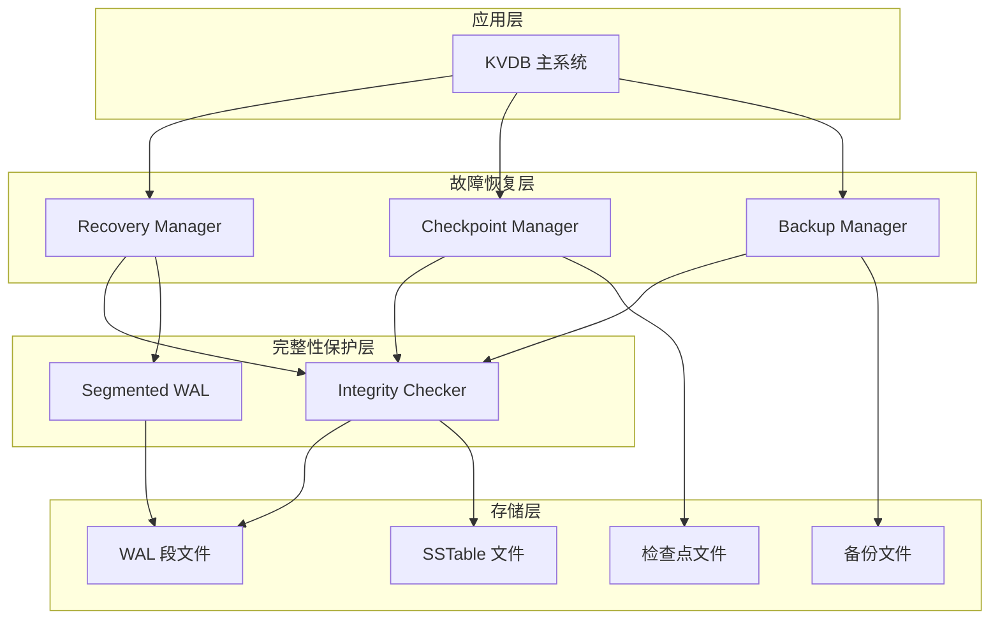

# 故障恢复优化设计文档

## 概述

故障恢复优化功能通过引入 CRC32 校验、WAL 分段、检查点机制和增量备份来提升 KVDB 系统的数据可靠性和恢复性能。设计采用分层架构，包含完整性检查层、分段 WAL 系统、恢复管理器、检查点系统和备份管理器。所有组件都与现有 KVDB 系统集成，同时保持向后兼容性。

## 架构

系统采用分层架构设计：



### 核心设计原则

1. **数据完整性优先**: 所有数据操作都包含 CRC32 校验
2. **并行恢复**: WAL 分段支持并行处理以提高恢复速度
3. **增量优化**: 检查点和增量备份减少恢复时间和存储需求
4. **向后兼容**: 新格式兼容现有数据文件
5. **故障隔离**: 损坏检测和恢复机制确保系统稳定性

## 组件和接口

### 1. IntegrityChecker 类

负责所有数据的 CRC32 校验和计算与验证。

```cpp
class IntegrityChecker {
public:
    // CRC32 计算和验证
    static uint32_t calculate_crc32(const uint8_t* data, size_t size);
    static bool verify_crc32(const uint8_t* data, size_t size, uint32_t expected_crc);
    
    // 块验证方法
    bool validate_block(const Block& block);
    bool validate_wal_entry(const WALEntry& entry);
    bool validate_sstable_block(const SSTableBlock& block);
    
    // 文件完整性验证
    IntegrityStatus validate_file(const std::string& file_path);
    ValidationReport validate_directory(const std::string& directory);
};
```

### 2. SegmentedWAL 类

实现 WAL 分段机制，支持并行恢复和高效存储。

```cpp
class SegmentedWAL {
public:
    // WAL 操作
    uint64_t write_entry(const WALEntry& entry);
    std::vector<WALEntry> get_entries_since_lsn(uint64_t lsn);
    
    // 段管理
    void seal_current_segment();
    void cleanup_old_segments(uint64_t min_lsn_to_keep);
    std::vector<WALSegment*> get_segments_for_recovery(uint64_t from_lsn);
    
    // 完整性验证
    IntegrityStatus validate_all_segments() const;
    ValidationReport validate_segments() const;
    
    // 兼容性接口
    void log_put(const std::string& key, const std::string& value);
    void log_del(const std::string& key);
    void replay(const std::function<void(const std::string&, const std::string&)>& on_put,
                const std::function<void(const std::string&)>& on_del);
};
```

### 3. WALSegment 类

单个 WAL 段的管理，包含段头部、条目存储和完整性验证。

```cpp
class WALSegment {
public:
    // 段操作
    bool add_entry(const WALEntry& entry);
    bool can_add_entry(const WALEntry& entry) const;
    void seal_segment();
    
    // 数据访问
    std::vector<WALEntry> get_entries_in_lsn_range(uint64_t start_lsn, uint64_t end_lsn) const;
    std::vector<WALEntry> read_entries_for_recovery() const;
    
    // 完整性验证
    IntegrityStatus validate_segment() const;
    bool verify_all_entries() const;
    
    // 持久化
    bool save_to_file();
    bool load_from_file();
};
```

### 4. RecoveryManager 类

协调恢复操作，支持并行处理和进度报告。

```cpp
class RecoveryManager {
public:
    // 恢复操作
    RecoveryResult recover_from_crash(uint64_t checkpoint_lsn = 0);
    RecoveryResult recover_from_backup(const std::string& backup_path);
    
    // 并行恢复
    RecoveryResult parallel_wal_recovery(const std::vector<WALSegment*>& segments);
    
    // 验证和报告
    bool verify_recovery_integrity();
    RecoveryReport generate_recovery_report() const;
    
    // 错误处理
    void handle_recovery_failure(const RecoveryError& error);
};
```

### 5. CheckpointManager 类

管理检查点的创建、存储和恢复。

```cpp
class CheckpointManager {
public:
    // 检查点操作
    CheckpointResult create_checkpoint();
    CheckpointResult create_checkpoint(const CheckpointTrigger& trigger);
    
    // 检查点管理
    std::vector<CheckpointInfo> list_checkpoints() const;
    bool restore_from_checkpoint(const std::string& checkpoint_id);
    void cleanup_old_checkpoints(size_t max_checkpoints);
    
    // 配置
    void configure_auto_checkpoint(const CheckpointConfig& config);
};
```

### 6. BackupManager 类

实现增量备份功能，基于 LSN 跟踪变更。

```cpp
class BackupManager {
public:
    // 备份操作
    BackupResult create_incremental_backup(const std::string& backup_path);
    BackupResult create_full_backup(const std::string& backup_path);
    
    // 恢复操作
    RestoreResult restore_from_backup_chain(const std::string& backup_path);
    
    // 备份管理
    std::vector<BackupInfo> list_backups(const std::string& backup_directory) const;
    BackupChainInfo analyze_backup_chain(const std::string& backup_path) const;
    
    // LSN 跟踪
    void track_file_changes(const std::string& file_path, uint64_t lsn);
    std::vector<std::string> get_changed_files_since_lsn(uint64_t lsn) const;
};
```

## 数据模型

### WALEntry 结构

增强的 WAL 条目包含 CRC32 校验和：

```cpp
struct WALEntry {
    uint64_t lsn;           // 日志序列号
    uint32_t entry_size;    // 条目大小
    uint32_t crc32;         // CRC32 校验和
    uint32_t entry_type;    // 条目类型 (PUT/DELETE)
    uint64_t timestamp;     // 时间戳
    std::vector<uint8_t> data; // 条目数据
    
    void calculate_crc32();
    bool verify_crc32() const;
    std::vector<uint8_t> serialize() const;
    static WALEntry deserialize(const std::vector<uint8_t>& data);
};
```

### SegmentHeader 结构

WAL 段头部包含元数据和校验和：

```cpp
struct SegmentHeader {
    uint32_t magic_number = 0xWAL5EG;  // 魔数
    uint32_t version = 1;              // 版本号
    uint64_t segment_id;               // 段 ID
    uint64_t start_lsn;                // 起始 LSN
    uint64_t end_lsn;                  // 结束 LSN
    uint32_t entry_count;              // 条目数量
    uint64_t segment_size;             // 段大小
    uint64_t creation_time;            // 创建时间
    uint32_t data_crc32;               // 数据 CRC32
    uint32_t header_crc32;             // 头部 CRC32
    uint32_t reserved[6];              // 保留字段
    
    bool is_valid() const;
    uint32_t calculate_header_crc32() const;
    bool verify_header_crc32() const;
    void update_header_crc32();
};
```

### CheckpointInfo 结构

检查点元数据：

```cpp
struct CheckpointInfo {
    std::string checkpoint_id;         // 检查点 ID
    uint64_t lsn;                      // 检查点 LSN
    uint64_t creation_time;            // 创建时间
    uint64_t file_size;                // 文件大小
    uint32_t file_crc32;               // 文件 CRC32
    std::string file_path;             // 文件路径
    CheckpointStatus status;           // 状态
};
```

### BackupMetadata 结构

备份元数据：

```cpp
struct BackupMetadata {
    std::string backup_id;             // 备份 ID
    BackupType type;                   // 备份类型 (FULL/INCREMENTAL)
    uint64_t base_lsn;                 // 基础 LSN
    uint64_t end_lsn;                  // 结束 LSN
    uint64_t creation_time;            // 创建时间
    std::vector<std::string> files;    // 文件列表
    std::string parent_backup_id;      // 父备份 ID
    uint32_t metadata_crc32;           // 元数据 CRC32
};
```

## 错误处理

### 完整性状态枚举

```cpp
enum class IntegrityStatus {
    OK,                    // 完整性正常
    CORRUPTION_DETECTED,   // 检测到损坏
    INVALID_FORMAT,        // 格式无效
    FILE_NOT_FOUND,        // 文件未找到
    ACCESS_DENIED          // 访问被拒绝
};
```

### 恢复错误处理

```cpp
enum class RecoveryError {
    CHECKPOINT_CORRUPTED,  // 检查点损坏
    WAL_SEGMENT_MISSING,   // WAL 段缺失
    BACKUP_CHAIN_BROKEN,   // 备份链断裂
    INSUFFICIENT_SPACE,    // 空间不足
    PERMISSION_DENIED      // 权限不足
};
```

### 错误恢复策略

1. **检查点损坏**: 尝试使用较早的检查点或完整 WAL 恢复
2. **WAL 段损坏**: 跳过损坏段，记录数据丢失
3. **备份链断裂**: 从最近的完整备份开始恢复
4. **资源不足**: 实施渐进式恢复和资源管理
5. **权限问题**: 进入只读模式，记录错误信息

## 测试策略

### 双重测试方法

系统采用单元测试和基于属性的测试相结合的方法：

**单元测试**:
- 验证具体示例和边界情况
- 测试组件间的集成点
- 验证错误条件和异常处理
- 测试向后兼容性场景

**基于属性的测试**:
- 验证跨所有输入的通用属性
- 通过随机化实现全面的输入覆盖
- 每个属性测试最少运行 100 次迭代
- 每个测试必须引用其设计文档属性

**属性测试配置**:
- 使用 C++ 的 RapidCheck 库进行基于属性的测试
- 每个属性测试运行最少 100 次迭代
- 测试标签格式: **Feature: fault-recovery-optimization, Property {number}: {property_text}**
- 每个正确性属性必须由单个基于属性的测试实现

## 正确性属性

*属性是应该在系统所有有效执行中保持为真的特征或行为——本质上是关于系统应该做什么的正式陈述。属性作为人类可读规范和机器可验证正确性保证之间的桥梁。*

基于需求分析，以下属性确保故障恢复优化系统的正确性：

### 属性 1：CRC32 校验和往返一致性
*对于任何*数据块，计算 CRC32 校验和然后验证应该返回成功状态，且损坏的数据应该被检测到
**验证需求：1.1, 1.2, 1.3**

### 属性 2：通用校验和覆盖
*对于任何*存储操作（WAL、SSTable、MemTable），系统应该包含校验和计算和验证步骤
**验证需求：1.4, 1.5, 8.3, 8.5**

### 属性 3：WAL 分段一致性
*对于任何*WAL 写入序列，当段达到最大大小时应该自动创建新段，且每个段应该包含正确的 LSN 范围
**验证需求：2.1, 2.2, 2.4**

### 属性 4：段校验和独立性
*对于任何*WAL 段，每个段应该维护独立的校验和，且段损坏不应影响其他段的完整性
**验证需求：2.5**

### 属性 5：并行恢复处理
*对于任何*多段 WAL 恢复操作，并行处理应该产生与串行处理相同的结果，但性能更优
**验证需求：2.3, 6.3**

### 属性 6：检查点创建和管理
*对于任何*检查点触发条件（时间或事务数量），系统应该创建包含完整数据库状态的检查点
**验证需求：3.1, 3.2, 3.3**

### 属性 7：基于检查点的恢复
*对于任何*有效检查点，从该检查点恢复应该将数据库恢复到检查点创建时的状态
**验证需求：3.4**

### 属性 8：检查点生命周期管理
*对于任何*检查点集合，当超过最大数量限制时，最旧的检查点应该被自动清理
**验证需求：3.5**

### 属性 9：增量备份正确性
*对于任何*LSN 范围，增量备份应该包含该范围内所有变更的文件，且备份元数据应该准确反映变更
**验证需求：4.1, 4.2**

### 属性 10：备份恢复顺序
*对于任何*备份链，恢复操作应该按正确的 LSN 顺序应用增量备份
**验证需求：4.3, 4.4**

### 属性 11：启动完整性验证
*对于任何*系统启动，关键文件的完整性验证应该在数据库操作开始前完成
**验证需求：5.1**

### 属性 12：损坏恢复行为
*对于任何*检测到的损坏，系统应该尝试恢复，如果恢复失败则进入只读模式，并记录详细信息
**验证需求：5.2, 5.3, 5.4, 5.5**

### 属性 13：恢复进度和错误报告
*对于任何*恢复操作，系统应该提供详细的进度报告，失败时应该提供清晰的错误信息
**验证需求：6.1, 6.2**

### 属性 14：恢复后完整性验证
*对于任何*恢复操作，完成后应该验证数据完整性，确保恢复的数据是正确的
**验证需求：6.4**

### 属性 15：资源限制处理
*对于任何*恢复过程中的资源限制，系统应该优雅处理并提供适当的错误信息或降级服务
**验证需求：6.5**

### 属性 16：WAL 解析往返一致性
*对于任何*有效的 WALEntry 对象，解析然后格式化然后解析应该产生等价的对象
**验证需求：7.1, 7.3, 7.4**

### 属性 17：无效输入错误处理
*对于任何*无效的 WAL 条目输入，解析器应该返回描述性错误而不是崩溃
**验证需求：7.2**

### 属性 18：向后兼容性保持
*对于任何*现有格式的 WAL 或 SSTable 文件，新系统应该能够正确读取和处理
**验证需求：8.1, 8.2**

### 属性 19：MVCC 兼容性维护
*对于任何*事务操作，故障恢复系统应该保持 MVCC 和快照隔离的正确性
**验证需求：8.4**